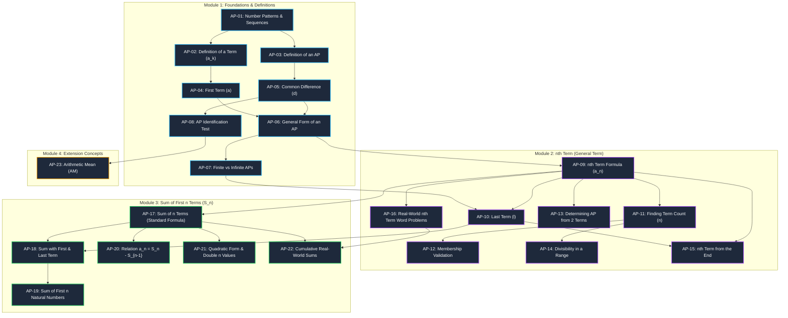

# Chapter 5: Arithmetic Progressions (Knowledge Graph)

## 1. Executive Summary & Curriculum Scope
This document defines the foundational **Knowledge Graph (KG)** for Class 10 Mathematics — *Chapter 5: Arithmetic Progressions*. It is designed for direct ingestion by **Hermes (AI Socratic Co-Teacher)**, adaptive student roadmap visualizers, and teacher diagnostic heatmaps.

---

## 2. Visual Learning Roadmap (Mermaid Dependency Graph)

---

## 3. Complete Concept Catalog & Hermes Socratic Rules

| Concept ID | Concept Name | Learning Goal (in 1 sentence) | Must Know Before (Prerequisites) | Unlocks Next | Common Mistake (The "Pitfall") | Hermes Socratic Guiding Question | Key Formula / Rule |
|:---|:---|:---|:---|:---|:---|:---|:---|
| **AP-01** | **Number Patterns & Sequences** | Students recognize that a sequence is an ordered list of numbers following a specific mathematical rule. | Basic Arithmetic Operations & Pattern Recognition | Definition of an AP & Common Difference | Assuming every growing pattern is an AP (e.g., confusing doubling $2, 4, 8, 16$ with additive steps). | *“Look at the jump between each pair of numbers: are we adding the exact same amount each step, or is something else changing?”* | $a_1, a_2, a_3, \dots, a_n$ |
| **AP-02** | **Definition of a Term ($a_k$)** | Students understand each number in a list is assigned a position-based identity called a term ($a_1, a_2 \dots a_n$). | Ordered Lists & Subscript Notation | Identifying First Term and Calculating Step Size | Confusing the term's value ($a_n$) with the term's position number ($n$). | *“Remember: $n$ is the rank/position (like 1st or 2nd place), while $a_n$ is the actual number sitting in that spot!”* | Position $k \rightarrow$ Term $a_k$ |
| **AP-03** | **Definition of an AP** | Students define an AP as a list where each term after the first is formed by adding a fixed constant to the predecessor. | Number Patterns & Definition of a Term | Common Difference & General Form of an AP | Thinking an AP can have changing increments between different pairs of numbers. | *“Does every consecutive pair have the exact same step size from start to finish?”* | $a_{k+1} = a_k + d$ |
| **AP-04** | **First Term ($a$ or $a_1$)** | Students identify $a$ as the initial anchor value of any arithmetic progression. | Definition of a Term | Constructing and Evaluating AP Series | Overlooking that $a$ is simply the very first number in the sequence. | *“Which number sits in the very first spot (position 1) of the list?”* | $a = a_1$ |
| **AP-05** | **Common Difference ($d$)** | Students calculate $d = a_{k+1} - a_k$, recognizing $d$ can be positive, negative, or zero. | Integer Subtraction (including negative numbers) | General Form of an AP & $n^{\text{th}}$ Term Formula | Subtracting backwards ($a_1 - a_2$ instead of $a_2 - a_1$), causing inverted signs. | *“Always subtract earlier from later ($a_2 - a_1$). If the numbers are decreasing, what sign must $d$ have?”* | $d = a_{k+1} - a_k$ |
| **AP-06** | **General Form of an AP** | Students express an AP algebraically as $a, a+d, a+2d, a+3d \dots a+(n-1)d$. | First Term ($a$) & Common Difference ($d$) | Formula for the $n^{\text{th}}$ Term ($a_n$) | Writing the $n^{\text{th}}$ term as $a + nd$ instead of $a + (n-1)d$. | *“Notice term 1 has $0$ '$d$'s, term 2 has $1$ '$d$', and term 3 has $2$ '$d$'s. How many '$d$'s should the $n^{\text{th}}$ term have?”* | $a, a+d, a+2d, \dots$ |
| **AP-07** | **Finite vs. Infinite APs** | Students differentiate between an AP with a limited count of terms having a last term ($l$) and an unending AP. | General Form of an AP | Last Term ($l$) & Sum of Finite Series | Assuming all APs continue forever without a definite endpoint. | *“Does this list stop at a specific final number, or does it have three dots (...) showing it continues forever?”* | Finite: has $l$; Infinite: no $l$ |
| **AP-08** | **AP Identification Test** | Students verify an AP by checking if $a_2 - a_1 = a_3 - a_2 = a_4 - a_3$ across all pairs. | Common Difference ($d$) | Finding Missing Terms in an AP | Testing only the first pair of terms and skipping subsequent pairs. | *“Did you check the difference between the 2nd and 3rd terms too, or just the first pair?”* | $a_{k+1} - a_k = \text{constant}$ |
| **AP-09** | **Formula for $n^{\text{th}}$ Term ($a_n$)** | Students compute any distant term directly using $a_n = a + (n-1)d$. | General Form of an AP & Linear Equations | Finding Term Count ($n$) & Word Problems | Multiplying $d$ by $n$ instead of $(n - 1)$. | *“Why do we multiply $d$ by $(n - 1)$? Remember, we didn't add any $d$ to get the very first term!”* | $a_n = a + (n - 1)d$ |
| **AP-10** | **Last Term of a Finite AP ($l$)** | Students identify the final term of an $n$-term AP as $l = a_n = a + (n-1)d$. | $n^{\text{th}}$ Term Formula | Quick Sum Formula $S_n = \frac{n}{2}(a + l)$ | Treating $l$ as an unrelated unknown rather than the final $a_n$. | *“If the list has $n$ items, what is the value of the term sitting at position $n$?”* | $l = a + (n - 1)d$ |
| **AP-11** | **Finding Term Position ($n$)** | Students solve a linear equation for $n$ when given $a_n, a,$ and $d$. | Solving Linear Equations & $a_n$ Formula | Membership Validation in an AP | Sign mistakes when moving $a$ across the equals sign before dividing by $d$. | *“Let's solve step by step: first subtract $a$ from both sides, then divide by $d$, and finally add $1$.”* | $n = \frac{a_n - a}{d} + 1$ |
| **AP-12** | **Membership Validation in AP** | Students check if a number belongs to an AP by verifying if position $n$ is a positive integer. | Finding Term Position ($n$) & Number Properties | Real-World Term Modeling | Accepting fractions (like $n = 33.5$) or negative values as valid term positions. | *“Can a student stand in position 33.5 or position -4? Position $n$ must always be a positive whole number!”* | $n \in \mathbb{N} = \{1, 2, 3, \dots\}$ |
| **AP-13** | **Determining AP from Two Terms** | Students find $a$ and $d$ by solving two simultaneous linear equations from two known terms. | Simultaneous Linear Equations in 2 Variables | Constructing Complete AP Sequences | Adding the two equations instead of subtracting them to eliminate $a$. | *“If $a + 2d = 5$ and $a + 6d = 9$, what happens if we subtract the first equation from the second to eliminate $a$?”* | $\begin{cases} a + (p-1)d = a_p \\ a + (q-1)d = a_q \end{cases}$ |
| **AP-14** | **Divisibility in a Range** | Students count multiples in an interval by finding the first multiple ($a$), last multiple ($l$), and step ($d$). | Divisibility Properties & $a_n$ Formula | Sum of Divisible Multiples | Picking the range boundary numbers as $a$ and $l$ even when not divisible. | *“What is the very first number inside your range that is actually divisible by the divisor?”* | $a = \text{first multiple}$, $d = \text{divisor}$ |
| **AP-15** | **$n^{\text{th}}$ Term from the End** | Students calculate terms backwards using $l - (n-1)d$ or by reversing the sequence. | Last Term ($l$) & $a_n$ Formula | Symmetric Properties of Progressions | Using $(\text{Total} - n)$ instead of $(\text{Total} - n + 1)$ when counting from the start. | *“If you reverse the list, the last term becomes the new first term and $d$ flips sign. Isn't that simpler?”* | $a_n' = l - (n - 1)d$ |
| **AP-16** | **Word Problems on $n^{\text{th}}$ Term** | Students translate real situations (salary hikes, ladder rungs, savings) into $a, d, n$. | Word Problem Translation & $a_n$ Formula | Real-World Cumulative Sums | Confusing the annual step ($d$) with the final target value ($a_n$). | *“Is that number the amount added each year ($d$), or the final target total ($a_n$)?”* | Linear Growth Models |
| **AP-17** | **Sum of First $n$ Terms ($S_n$)** | Students compute total sum using $S_n = \frac{n}{2}[2a + (n-1)d]$. | $a_n$ Formula & Algebraic Expansion | Short Sum Formula with $l$ | Forgetting the factor of $2$ in front of $a$ inside the bracket $[2a + (n-1)d]$. | *“Check inside the bracket: did you write '$2a$' or just '$a$'? It must be $2a$ because we pair terms from both ends!”* | $S_n = \frac{n}{2}[2a + (n - 1)d]$ |
| **AP-18** | **Sum with First & Last Term** | Students calculate sums quickly using $S_n = \frac{n}{2}(a + l)$ when first and last terms are known. | Standard Sum Formula & Last Term ($l$) | Sum of First $n$ Natural Numbers | Trying to use this formula when the total number of terms ($n$) is still unknown. | *“We know '$a$' and '$l$', but do we know how many terms ($n$) there are yet? Let's find $n$ first using $a_n = a + (n-1)d$.”* | $S_n = \frac{n}{2}(a + l)$ |
| **AP-19** | **Sum of First $n$ Natural Numbers** | Students apply Gauss's formula $S_n = \frac{n(n+1)}{2}$ for consecutive positive integers. | Short Sum Formula | Number Theory & Consecutive Series | Applying this formula to series that do not start at $1$ or do not increase by $1$. | *“Notice this formula only works when the list starts at $1$ and goes up by $1$ each time ($1, 2, 3\dots n$).”* | $S_n = \frac{n(n + 1)}{2}$ |
| **AP-20** | **Relation: $a_n = S_n - S_{n-1}$** | Students extract any specific term or the common difference directly from a given sum expression $S_n$. | Polynomial Subtraction & Sum Concepts | Analyzing AP Properties from $S_n$ | Calculating $S_n - S_{n+1}$ instead of $S_n - S_{n-1}$. | *“If you remove the sum of the first $(n - 1)$ terms from the sum of all $n$ terms, what single term remains?”* | $a_n = S_n - S_{n-1}$ |
| **AP-21** | **Quadratic $S_n$ & Double $n$ Values** | Students solve quadratic equations in $n$ from $S_n$ and interpret why two $n$ values can have identical sums. | Quadratic Equations & Sum Formula | Advanced AP Real-World Dynamics | Discarding a valid integer $n$ without realizing terms cancel out due to negative values. | *“Why are both values of $n$ valid? Look at the terms: after positive numbers, negative terms cancel them out!”* | $An^2 + Bn - S_n = 0$ |
| **AP-22** | **Real-World Cumulative Sums** | Students model real problems (tiered logs, semicircle spirals, delay penalties, relay races) as AP sums. | Sum of $n$ Terms Formulas & Geometry | Multi-Disciplinary STEM Modeling | Calculating only the single end term ($a_n$) instead of the accumulated sum ($S_n$). | *“Does the question ask for the cost on day 30 alone ($a_n$), or the total accumulated cost over all 30 days combined ($S_n$)?”* | $\sum_{i=1}^n a_i$ |
| **AP-23** | **Arithmetic Mean ($AM$)** | Students understand that for any three terms in AP ($a, b, c$), the middle term is the average: b = \frac{a+c}{2}. | Basic Averages & AP Identification | Inserting Means between Numbers | Confusing arithmetic mean (additive middle) with geometric mean (multiplicative middle). | *“If $b - a = c - b$, what happens when you add '$b$' to both sides and '$a$' to both sides? You get $2b = a + c$!”* | $b = \frac{a + c}{2}$ |

---

## 4. Teacher Diagnostic Hotspots
When Hermes monitors student sessions, telemetry flags the following concept IDs as high-priority intervention triggers:

1. **Hotspot 1 (Concept AP-05)**: Sign confusion in decreasing APs (e.g. $d = -2$ being entered as $+2$).
2. **Hotspot 2 (Concept AP-09 vs AP-06)**: Off-by-one formula error ($a + nd$ instead of $a + (n-1)d$).
3. **Hotspot 3 (Concept AP-12)**: Forgetting that term position $n$ cannot be a decimal/fraction.
4. **Hotspot 4 (Concept AP-21)**: Confusion over double positive values of $n$ in quadratic sum problems.
